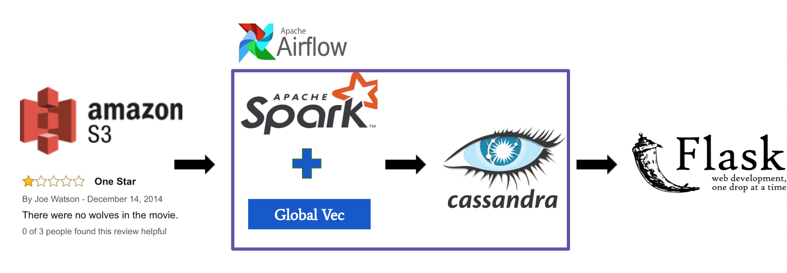

# FakeOUT

## Table of Contents
1. [Introduction](README.md#Introduction)
2. [Pipeline](README.md#Pipeline)
3. [Global Vector Model](README.md#Global%20Vector%20Model)
4. [Requirements](README.md#Requirements)
5. [Environment Setup](README.md#Environment%20Setup)

## Introduction

Have you ever found a product on Amazon website, full of 5 stars reviews, you thought you would love it and decided to buy it home. But when you got the product it's totally not you expected and felt disappointed? 

A report from the Washington Post shows that the majority of reviews in certain Amazon product categories are fraudulent or paid. Companies hire professional reviewers or robots to post glowing reviews to themselves or attack their competitors. My project uses 100G of Amazon reviews data to detect potential fake accounts on Amazon and gives warning to them when they are reading the reviews so that shoppers will think twice before buying the product.

## Pipeline:

The Amazon customer reviews data is stored in AWS S3. Spark reads the reviews and runs NLP preprocessing using spark Machine Learning Pipeline library including tokenization and stopwords remover. External pre-trained NLP models, Global Vector and tfidf, are used for text comparison. 

Text comparison process:
1. Word embedding with pre-trained Global Vector model
2. Sentence embedding with pre-trained tfidf model
3. Calculate cosine similarity between each pair of review vectors 

Depends on how many similar reviews one user has, a customized algorithm decides which account is fake and store the information in the Cassandra.

Airflow schedules a daily job to trigger Spark update the database when new reviews come in.

## Global Vector Model:

Global Vector is a well known Nature Language Model. It projects each word to a high dimensionaly vector. And I am loading the pre-trained word vectors trained by google team, which uses millions of wikipeidia articles to train the word vectors.
[Read more](https://nlp.stanford.edu/projects/glove/)

## Requirements

* Amazon AWS Account
* Cassandra Cluster with Cassandra installed
* Spark Cluster with Spark, Cassandra-connector installed
* Flask node with Flask, Dash installed
* Airflow node with Airflow, Postgres installed

## Environment Setup:

**Cassandra**
##### To use python cassandra
- sudo pip install cassandra-driver

##### To use spark cassandra connector
Download from [here](http://www.apache.org/dyn/closer.lua/cassandra/3.11.3/apache-cassandra-3.11.3-bin.tar.gz)

Follow instructions for Installing from binary tarball [here](http://cassandra.apache.org/doc/latest/getting_started/installing.html)

In cqlsh:
- create keyspace project;
- create keyspace project with replication = { 'class' : 'SimpleStrategy', 'replication_factor' : 2 };

For cassandra-spark connector:

Following instructions from: https://www.codementor.io/sheena/installing-cassandra-spark-linux-debian-ubuntu-14-du107vbhx

- git clone https://github.com/datastax/spark-cassandra-connector.git
- cd spark-cassandra-connector/
- git ch v2.3.2
- ./sbt/sbt assembly
- cp spark-cassandra-connector/target/full/scala-2.11/spark-cassandra-connector-assembly-2.3.2.jar ~
- spark-shell --jars ~/spark-cassandra-connector-assembly-2.3.2.jar --conf spark.cassandra.connection.host="10.0.0.7"

