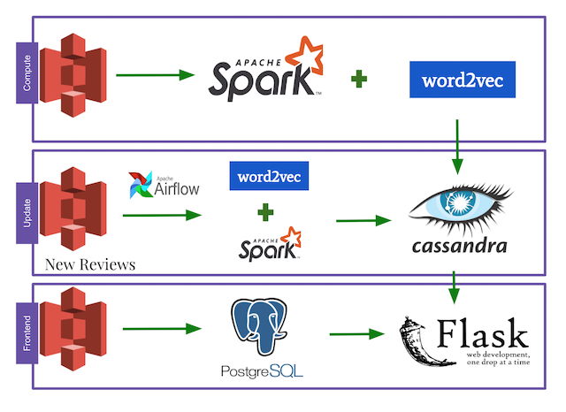

# FakeOUT

## Introduction

Have you ever found a product on Amazon website, full of 5 stars reviews, but when you got the product it's totally not you expected and felt disappointed? A report from Washington Post shows that Majority of reviews in certain Amazon product categories are fraudulent or paid. Company hires professtional reviewers or robots to post glowing reviews to themselves or attack their competitiors. My project uses 100G of Amazon reviews data to detect potential fake accounts on Amazon and gives warning to them when they are reading the reviews so that shoppers will think twice before buy the product. 

## Data Pipeline:

## Data Processing:

 The reviews data is extracted from S3 datasource. ML pipeline is used for processing and cleaning the text data. The processed data are fed into NLP word2vec model and then conduct text comparison. The results are stored in Cassandra and will be queried by Flask to visualize the result.